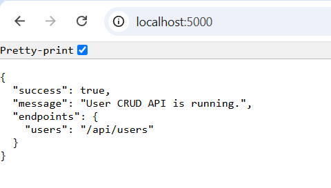
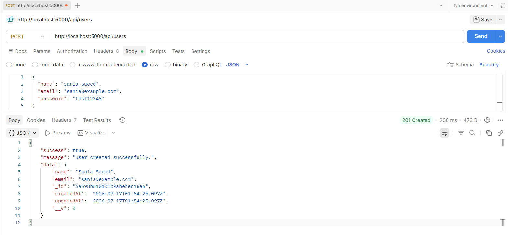
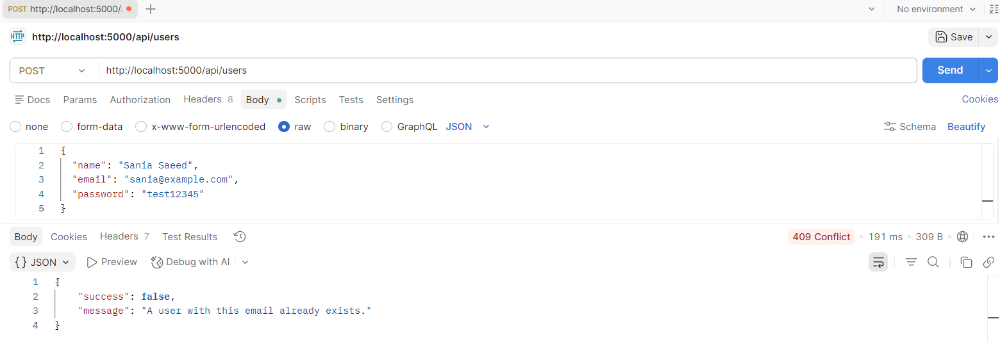
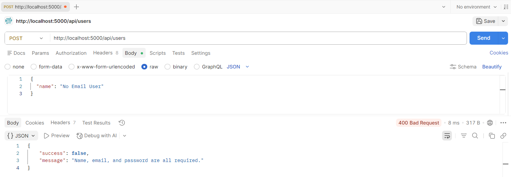
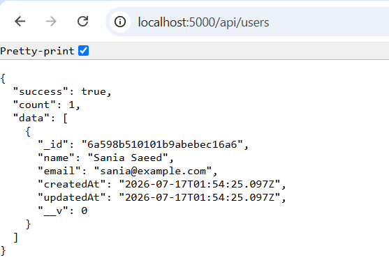
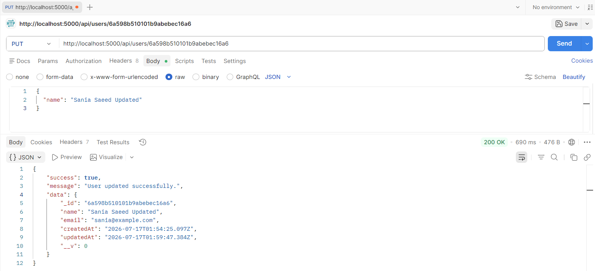

# User CRUD API

A REST API for managing users, built with Node.js, Express, and MongoDB (via Mongoose). Data is permanently stored in a database, with full Create, Read, Update, and Delete operations.

Built as **Project 2: Database Integration (CRUD)** — DecodeLabs Industrial Training Kit, Batch 2026.

## Overview

This project connects a REST API to MongoDB using Mongoose as the ORM. It implements a `User` resource with full CRUD operations, schema-level validation, and duplicate-entry prevention at the database level.

## Features

- Full CRUD operations on a User resource
- MongoDB persistence via Mongoose
- Duplicate email prevention with a proper `409 Conflict` response
- Password hashing before storage (bcrypt) — never stored or returned in plain text
- Schema validation with clear, specific error messages
- Centralized error handling for database and validation errors
- ES Modules throughout

## Tech Stack

- Node.js
- Express
- MongoDB
- Mongoose
- bcryptjs

## Getting Started

**Prerequisites:** Node.js v16+, and a running MongoDB instance (local or Atlas)

```bash
git clone https://github.com/SaniaSaeed2/user-crud-api.git
cd user-crud-api
npm install
```

Create a `.env` file  and set:

```
MONGO_URI=mongodb://localhost:27017/user-crud-api
PORT=5000
```

Run the server:

```bash
node index.js
```

Server runs at `http://localhost:5000`

## API Endpoints

| Method | Route            | Description             |
|--------|-------------------|---------------------------|
| GET    | `/`               | API status                |
| POST   | `/api/users`      | Create a new user          |
| GET    | `/api/users`      | Get all users               |
| GET    | `/api/users/:id`  | Get a single user by ID      |
| PUT    | `/api/users/:id`  | Update a user by ID          |
| DELETE | `/api/users/:id`  | Delete a user by ID          |

**POST /api/users — request body:**
```json
{
  "name": "Sania Saeed",
  "email": "sania@example.com",
  "password": "test12345"
}
```

## Screenshots

**Root endpoint**



**Create user (POST)**



**Duplicate email prevention**



**Validation error**



**Get all users**



**Update user (PUT)**



## Error Handling

| Status | Meaning                                  |
|--------|--------------------------------------------|
| 400    | Missing/invalid fields or malformed ID        |
| 404    | User not found                                |
| 409    | Duplicate email                               |
| 500    | Unexpected server error                       |

## Design Notes

- Passwords are hashed with bcrypt before saving and stripped from every API response.
- The `email` field has a unique index at the schema level — MongoDB itself rejects duplicates, and the error handler converts that into a clean `409` instead of a raw database error.
- Route parameters are validated as proper MongoDB ObjectIds before querying, so an invalid ID returns `400` instead of crashing the request.
- `runValidators: true` is applied on updates so partial updates still respect schema rules.

## Author

Built as part of the DecodeLabs Industrial Training Kit — Backend Development, Project 2.
